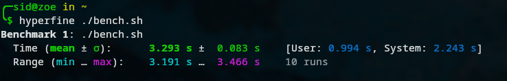

# Gopher_store

A simple kv store based on the RESP protocol implemented in Go! Fully compatible with the redis-cli.
Supports simple GET and SET operations for now.

## Benchmarks

## TODO:
- Implement suppot for more commands: such as HSET etc
